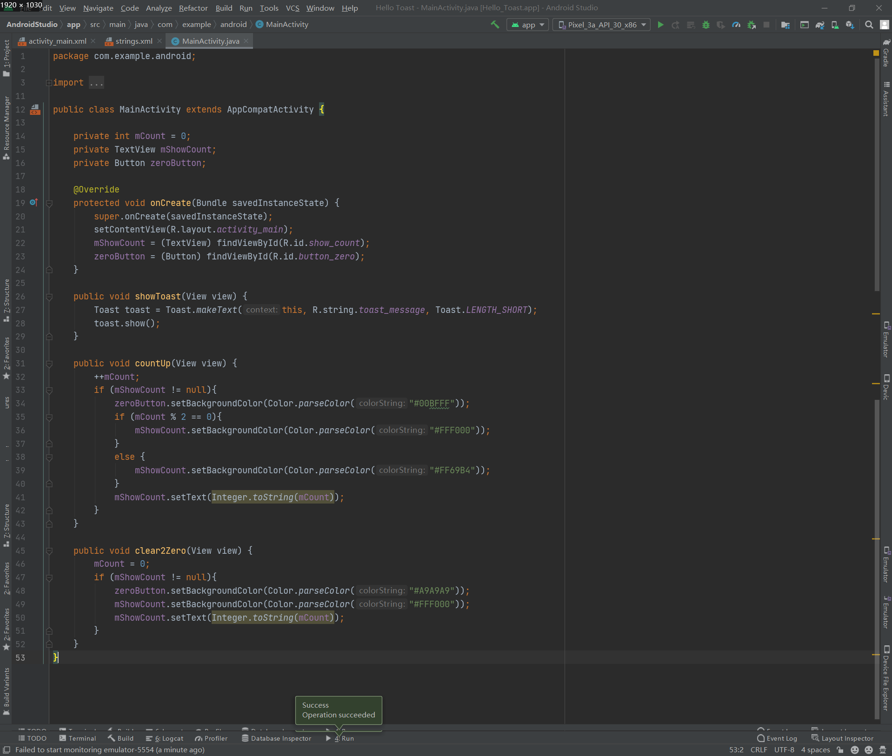
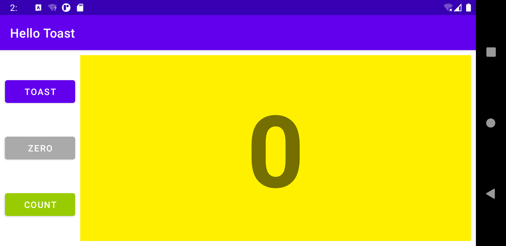
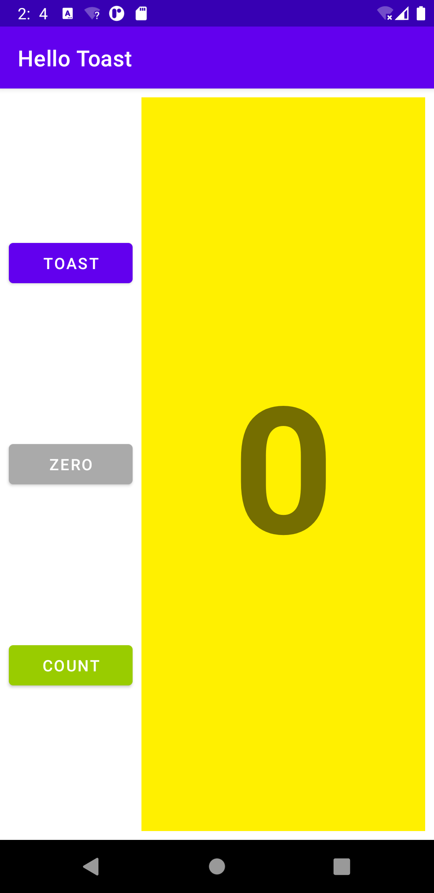

## Lab03. Layouts and resources for the UI

### 3-1. 代码截图:

### 3-2. **运行截图：**

- **横屏**

  

- **竖屏**

  

### 3-3. 运行时录屏：

- **横屏**

  <video src="./horizontal.mp4"></video>

- **竖屏**

  <video src="./vertical.mp4"></video>