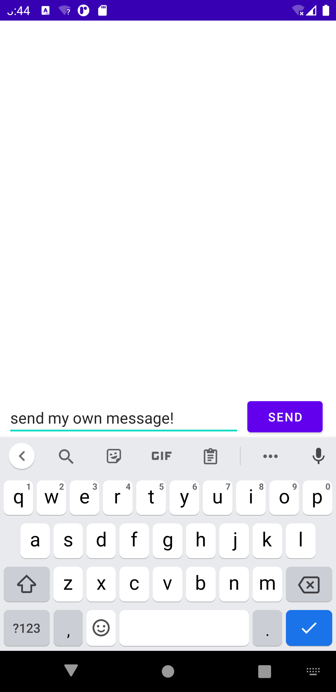
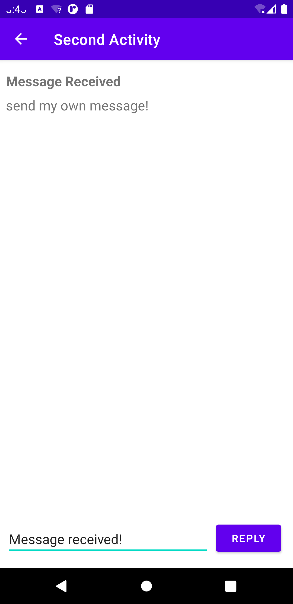
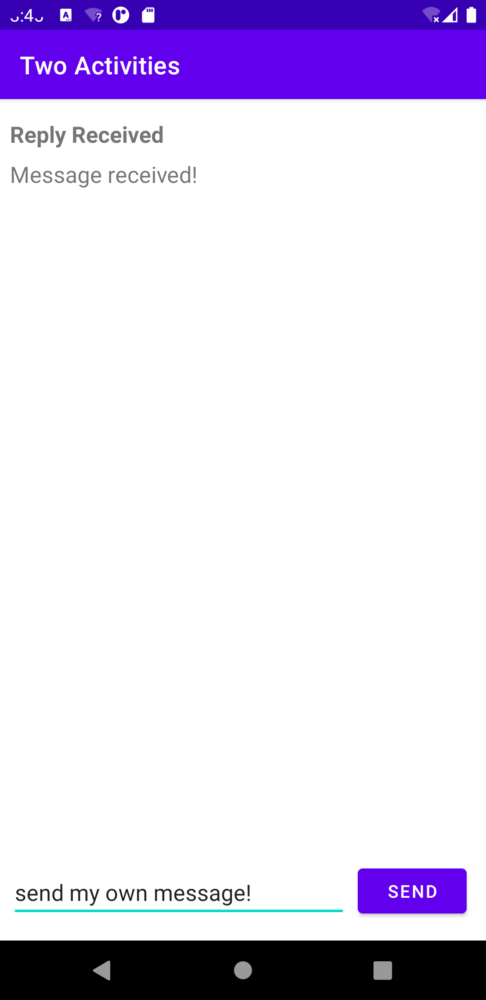
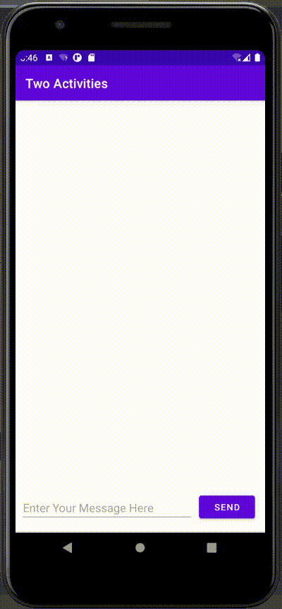
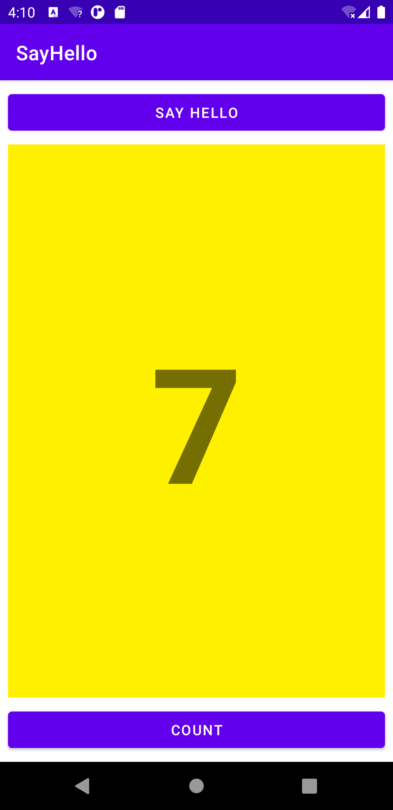
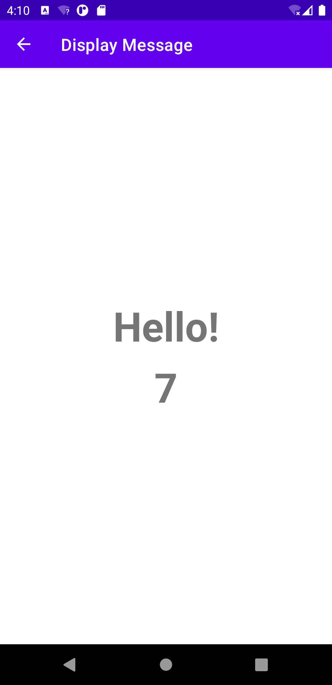
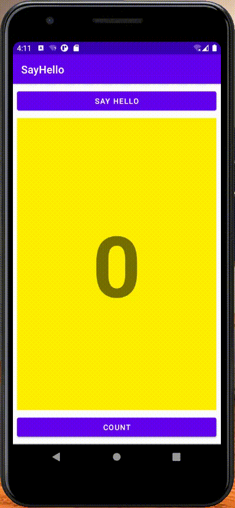

# Lab04. Activities And Intents

## Practice:

- running screen shot

  


- running video

  


## Homework:

- running screen shot

  

  

- running video

  


- key code

  - MainActivity.java

  ```java
  package com.example.sayhello;
  
  import androidx.appcompat.app.AppCompatActivity;
  
  import android.content.Intent;
  import android.os.Bundle;
  import android.util.Log;
  import android.view.View;
  import android.widget.Button;
  import android.widget.TextView;
  
  public class MainActivity extends AppCompatActivity {
      private static final String LOG_TAG = MainActivity.class.getSimpleName();
      public static final String EXTRA_MESSAGE = "com.example.sayhello.extra.COUNT_MESSAGE";
      private int count = 0;
      private TextView countTextView;
  
      @Override
      protected void onCreate(Bundle savedInstanceState) {
          super.onCreate(savedInstanceState);
          setContentView(R.layout.activity_main);
  //        count = 0;
          countTextView = (TextView) findViewById(R.id.show_count);
      }
  
  
      public void launchSecondActivity(View view) {
          Log.d(LOG_TAG, "Button clicked!");
          Intent intent = new Intent(this, MessageActivity.class);
          intent.putExtra(EXTRA_MESSAGE, count);
          startActivity(intent);
      }
  
      public void countUp(View view) {
          ++count;
          if (countTextView != null) {
              countTextView.setText(Integer.toString(count));
          }
      }
  }
  ```

  - MessageActivity.java

  ```java
  package com.example.sayhello;
  
  import androidx.appcompat.app.AppCompatActivity;
  
  import android.content.Intent;
  import android.os.Bundle;
  import android.widget.TextView;
  
  public class MessageActivity extends AppCompatActivity {
  
      @Override
      protected void onCreate(Bundle savedInstanceState) {
          super.onCreate(savedInstanceState);
          setContentView(R.layout.activity_message);
          Intent intent = getIntent();
          int count = intent.getIntExtra(MainActivity.EXTRA_MESSAGE, 0);
          TextView textView = findViewById(R.id.show_number);
          textView.setText(Integer.toString(count));
      }
  }
  ```

  

