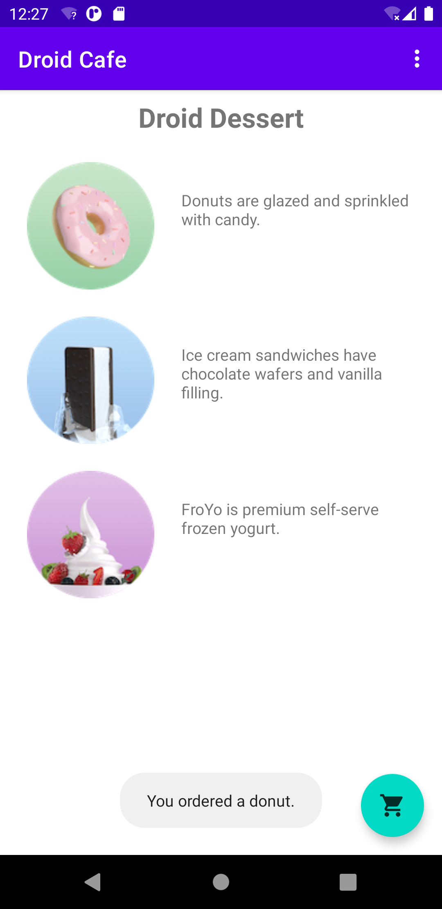
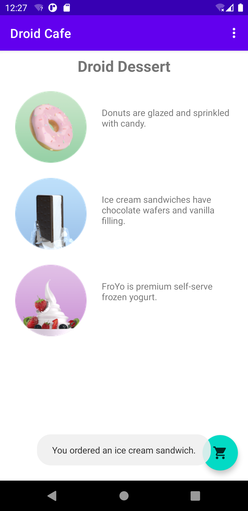
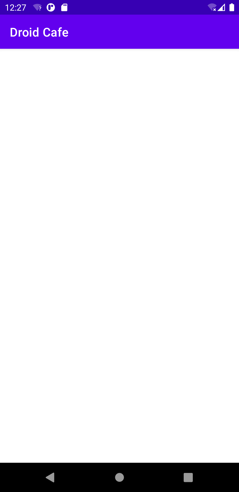
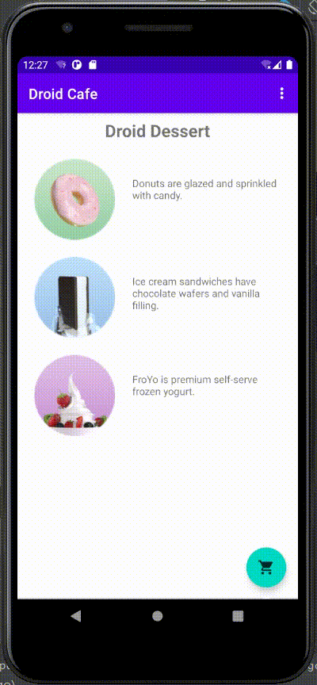
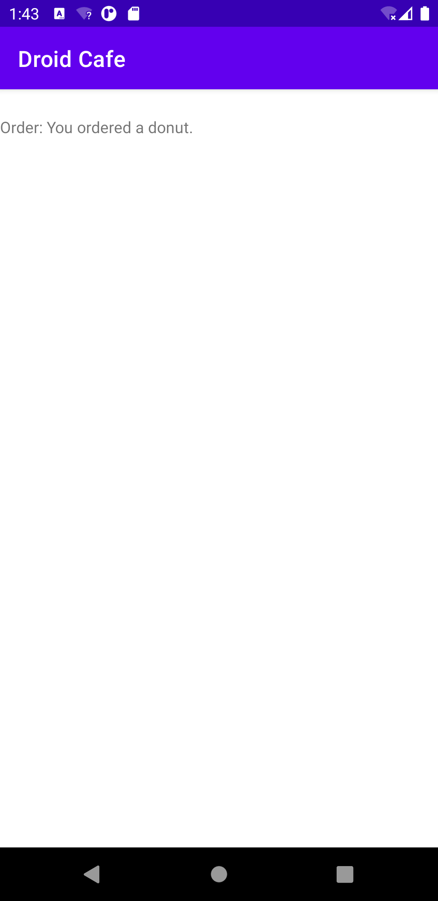
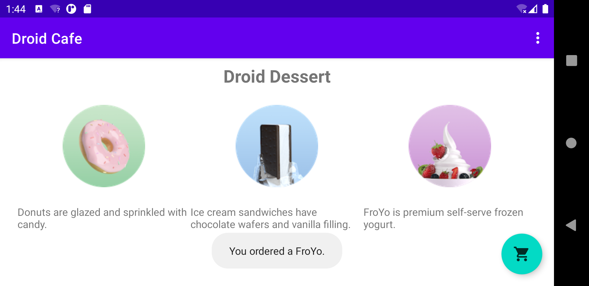
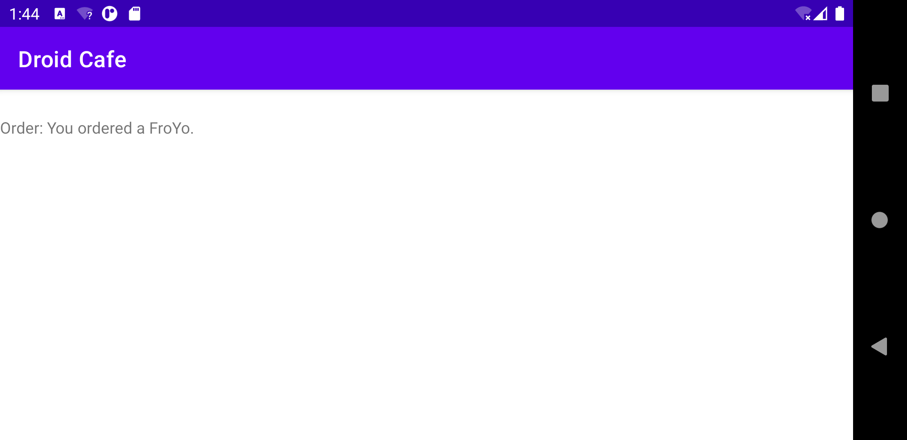
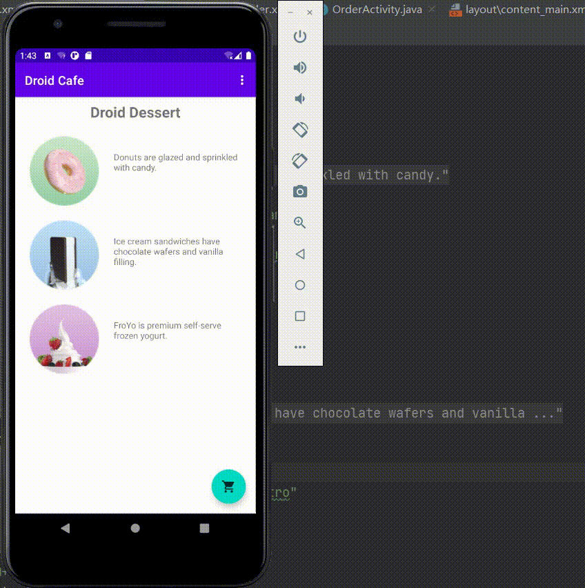

# Lab06. User Interface

## Practice:

- running screen shot

  - tap donut: 
  
  
  
  - tap ice-cream:
  
    
  
  - tap froyo: 
  
  
  
  - tap shopping cart:
  
  

- running video

  

## Homework:

- running screen shot

  - **vertical: **show order information

  &nbsp;&nbsp; &nbsp; &nbsp;

  

  - **horizontal: **show order information

  

  

  

- running video

  

