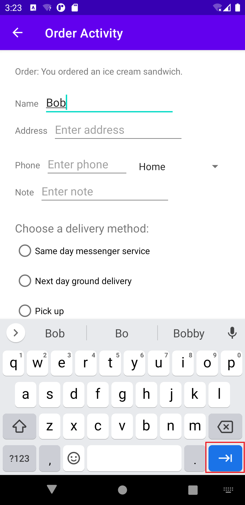
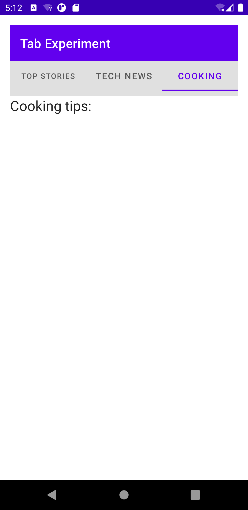

# Lab07. User Interface II

## Practice:

### Part A:

- running screen shot

  -  ` android:inputType = "textPersonName"  `
  
    
  
  - ` android:inputType = "textMultiLine"  `
  
    
  
  - ` android:inputType = "phone"  `(with drop-down list)
  
  
  
  - ` android:inputType = "textCapSentences|textMultiLine"  `
  
  
  
  - radio buttons
  
  
  
  - up navigation
  
  

- running video

  

### Part B:

- running screen shot

  - tab-1:  TOP STORIES

  

  - tab-2: TECH NEWS

    

  - tab-3:  COOKING

  

- running video

  

  

### Part C:

- running screen shot

  - show word list:

  

  - click a word:

    

  - add new words and clicked them:

  

- running video

  

