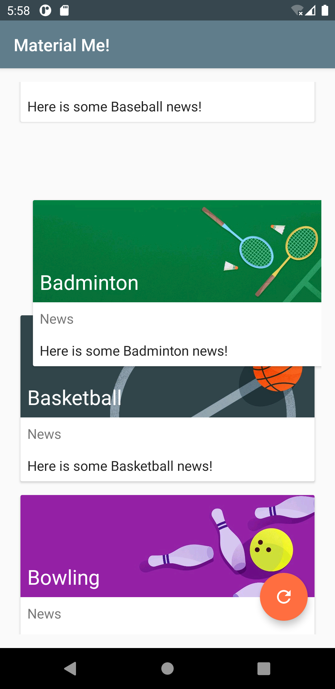
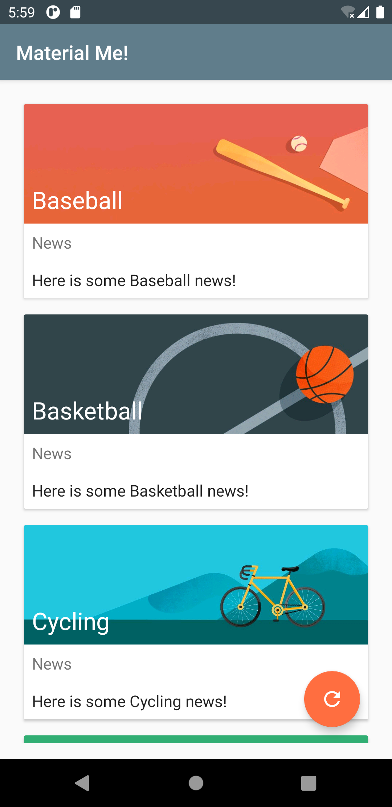
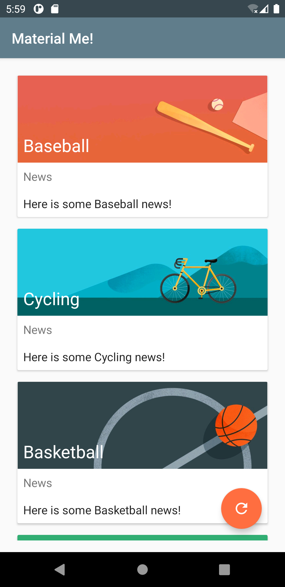
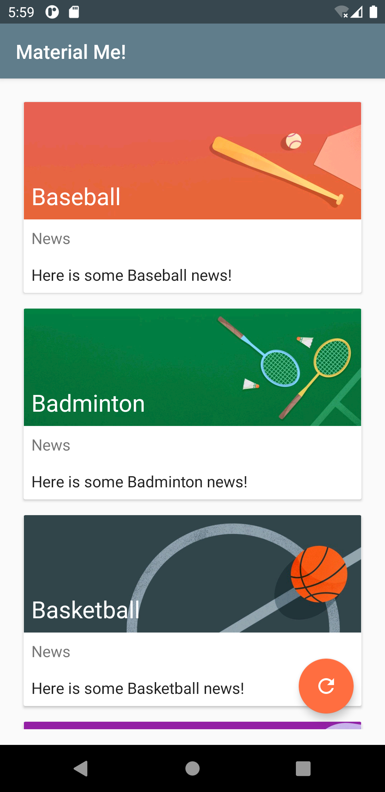
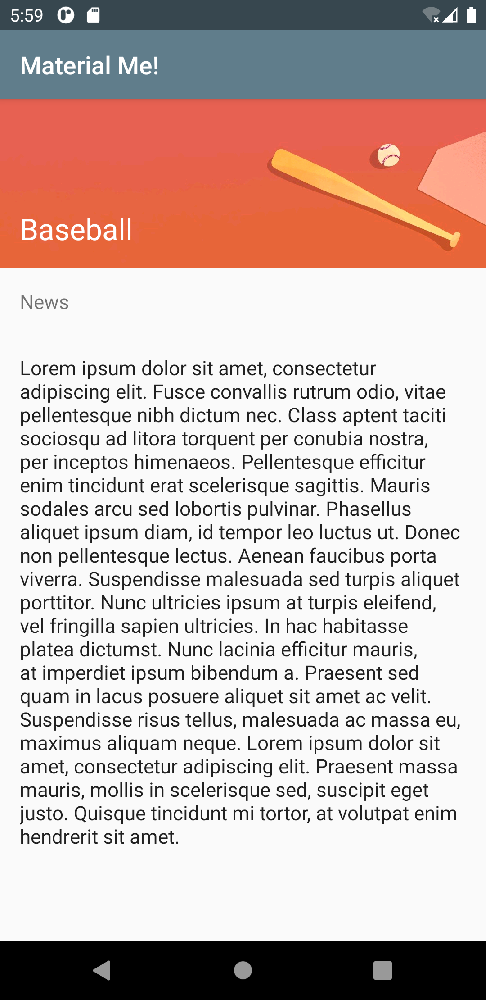
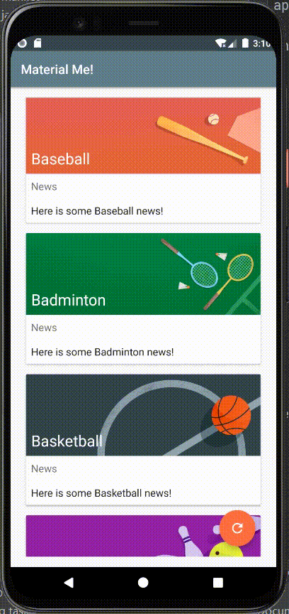

# Lab08. Material Design

## Practice:

- running screen shot

  -  initial page with card view:
  
    
  
  - each card can be moved:
  
    
  
  - delete some cards:
  
      ->    ~    
  
  - switch two cards:
  
      ~    
  
  - tap refresh button:
  
      ~    
  
  - tap card:
  
  


- running video

  


## Homework:

- running screen shot

  


## Key Code:

- DetailActivity.java

```java
package com.example.android.materialme;

import android.os.Build;
import android.support.v7.app.AppCompatActivity;
import android.os.Bundle;
import android.transition.Explode;
import android.view.Window;
import android.widget.ImageView;
import android.widget.TextView;

import com.bumptech.glide.Glide;

public class DetailActivity extends AppCompatActivity {

    @Override
    protected void onCreate(Bundle savedInstanceState) {
        // Check if we're running on Android 5.0 or higher
        if (Build.VERSION.SDK_INT >= Build.VERSION_CODES.LOLLIPOP) {
            // Apply activity transition
            // inside your activity (if you did not enable transitions in your theme)
            getWindow().requestFeature(Window.FEATURE_ACTIVITY_TRANSITIONS);

        } else {
            // Swap without transition
        }

        super.onCreate(savedInstanceState);
        setContentView(R.layout.activity_detail);

        TextView sportsTitle = findViewById(R.id.titleDetail);
        ImageView sportsImage = findViewById(R.id.sportsImageDetail);
        sportsTitle.setText(getIntent().getStringExtra("title"));
        Glide.with(this).load(getIntent().getIntExtra("image_resource", 0)).into(sportsImage);

    }
}
```


- MainActivity.java

```java
/*
 * Copyright (C) 2018 Google Inc.
 *
 * Licensed under the Apache License, Version 2.0 (the "License");
 * you may not use this file except in compliance with the License.
 * You may obtain a copy of the License at
 *
 *      http://www.apache.org/licenses/LICENSE-2.0
 *
 * Unless required by applicable law or agreed to in writing, software
 * distributed under the License is distributed on an "AS IS" BASIS,
 * WITHOUT WARRANTIES OR CONDITIONS OF ANY KIND, either express or implied.
 * See the License for the specific language governing permissions and
 * limitations under the License.
 */

package com.example.android.materialme;

import android.content.res.TypedArray;
import android.os.Build;
import android.os.Bundle;
import android.support.v7.app.AppCompatActivity;
import android.support.v7.widget.LinearLayoutManager;
import android.support.v7.widget.RecyclerView;
import android.support.v7.widget.helper.ItemTouchHelper;
import android.transition.Explode;
import android.view.View;
import android.view.Window;

import java.util.ArrayList;
import java.util.Collections;

/***
 * Main Activity for the Material Me app, a mock sports news application
 * with poor design choices.
 */
public class MainActivity extends AppCompatActivity {

    // Member variables.
    private RecyclerView mRecyclerView;
    private ArrayList<Sport> mSportsData;
    private SportsAdapter mAdapter;

    @Override
    protected void onCreate(Bundle savedInstanceState) {
        // Check if we're running on Android 5.0 or higher
        if (Build.VERSION.SDK_INT >= Build.VERSION_CODES.LOLLIPOP) {
            // Apply activity transition
            // inside your activity (if you did not enable transitions in your theme)
            getWindow().requestFeature(Window.FEATURE_ACTIVITY_TRANSITIONS);

        } else {
            // Swap without transition
        }

        super.onCreate(savedInstanceState);
        setContentView(R.layout.activity_main);

        // Initialize the RecyclerView.
        mRecyclerView = findViewById(R.id.recyclerView);

        // Set the Layout Manager.
        mRecyclerView.setLayoutManager(new LinearLayoutManager(this));

        // Initialize the ArrayList that will contain the data.
        mSportsData = new ArrayList<>();

        // Initialize the adapter and set it to the RecyclerView.
        mAdapter = new SportsAdapter(this, mSportsData);
        mRecyclerView.setAdapter(mAdapter);

        // Get the data.
        initializeData();

        ItemTouchHelper helper = new ItemTouchHelper(
                new ItemTouchHelper.SimpleCallback(
                        ItemTouchHelper.LEFT | ItemTouchHelper.RIGHT | ItemTouchHelper.DOWN | ItemTouchHelper.UP,
                        ItemTouchHelper.LEFT | ItemTouchHelper.RIGHT) {
                    @Override
                    public boolean onMove(RecyclerView recyclerView, RecyclerView.ViewHolder viewHolder, RecyclerView.ViewHolder target) {
                        int from = viewHolder.getAdapterPosition();
                        int to = target.getAdapterPosition();
                        Collections.swap(mSportsData, from, to);
                        mAdapter.notifyItemMoved(from, to);
                        return true;
                    }

                    @Override
                    public void onSwiped(RecyclerView.ViewHolder viewHolder, int direction) {
                        mSportsData.remove(viewHolder.getAdapterPosition());
                        mAdapter.notifyItemRemoved(viewHolder.getAdapterPosition());
                    }
                }
        );
        helper.attachToRecyclerView(mRecyclerView);
    }

    /**
     * Initialize the sports data from resources.
     */
    private void initializeData() {
        // Get the resources from the XML file.
        String[] sportsList = getResources()
                .getStringArray(R.array.sports_titles);
        String[] sportsInfo = getResources()
                .getStringArray(R.array.sports_info);
        TypedArray sportsImageResources = getResources().obtainTypedArray(R.array.sports_images);

        // Clear the existing data (to avoid duplication).
        mSportsData.clear();

        // Create the ArrayList of Sports objects with titles and
        // information about each sport.
        for(int i=0;i<sportsList.length;i++){
            mSportsData.add(new Sport(sportsList[i], sportsInfo[i],
                    sportsImageResources.getResourceId(i, 0)));
        }

        sportsImageResources.recycle();

        // Notify the adapter of the change.
        mAdapter.notifyDataSetChanged();
    }

    public void resetSports(View view) {
        this.initializeData();
    }
}
```


- Sport.java

```java
/*
 * Copyright (C) 2018 Google Inc.
 *
 * Licensed under the Apache License, Version 2.0 (the "License");
 * you may not use this file except in compliance with the License.
 * You may obtain a copy of the License at
 *
 *      http://www.apache.org/licenses/LICENSE-2.0
 *
 * Unless required by applicable law or agreed to in writing, software
 * distributed under the License is distributed on an "AS IS" BASIS,
 * WITHOUT WARRANTIES OR CONDITIONS OF ANY KIND, either express or implied.
 * See the License for the specific language governing permissions and
 * limitations under the License.
 */

package com.example.android.materialme;

/**
 * Data model for each row of the RecyclerView
 */
class Sport {

    // Member variables representing the title and information about the sport.
    private String title;
    private String info;
    private final int imageResource;

    /**
     * Constructor for the Sport data model.
     *
     * @param title The name if the sport.
     * @param info Information about the sport.
     */
    Sport(String title, String info, int imageResource) {
        this.title = title;
        this.info = info;
        this.imageResource = imageResource;
    }

    /**
     * Gets the title of the sport.
     *
     * @return The title of the sport.
     */
    String getTitle() {
        return title;
    }

    /**
     * Gets the info about the sport.
     *
     * @return The info about the sport.
     */
    String getInfo() {
        return info;
    }

    public int getImageResource() { return this.imageResource; }

}
```


- SportsAdapter.java

```java
/*
 * Copyright (C) 2018 Google Inc.
 *
 * Licensed under the Apache License, Version 2.0 (the "License");
 * you may not use this file except in compliance with the License.
 * You may obtain a copy of the License at
 *
 *      http://www.apache.org/licenses/LICENSE-2.0
 *
 * Unless required by applicable law or agreed to in writing, software
 * distributed under the License is distributed on an "AS IS" BASIS,
 * WITHOUT WARRANTIES OR CONDITIONS OF ANY KIND, either express or implied.
 * See the License for the specific language governing permissions and
 * limitations under the License.
 */

package com.example.android.materialme;

import android.app.Activity;
import android.app.ActivityOptions;
import android.content.Context;
import android.content.Intent;
import android.os.Build;
import android.support.annotation.RequiresApi;
import android.support.v4.app.ActivityOptionsCompat;
import android.support.v7.widget.RecyclerView;
import android.view.LayoutInflater;
import android.view.View;
import android.view.ViewGroup;
import android.widget.ImageView;
import android.widget.TextView;

import com.bumptech.glide.Glide;

import java.util.ArrayList;

/***
 * The adapter class for the RecyclerView, contains the sports data.
 */
class SportsAdapter extends RecyclerView.Adapter<SportsAdapter.ViewHolder>  {

    // Member variables.
    private ArrayList<Sport> mSportsData;
    private Context mContext;

    /**
     * Constructor that passes in the sports data and the context.
     *
     * @param sportsData ArrayList containing the sports data.
     * @param context Context of the application.
     */
    SportsAdapter(Context context, ArrayList<Sport> sportsData) {
        this.mSportsData = sportsData;
        this.mContext = context;
    }


    /**
     * Required method for creating the viewholder objects.
     *
     * @param parent The ViewGroup into which the new View will be added
     *               after it is bound to an adapter position.
     * @param viewType The view type of the new View.
     * @return The newly created ViewHolder.
     */
    @Override
    public SportsAdapter.ViewHolder onCreateViewHolder(
            ViewGroup parent, int viewType) {
        return new ViewHolder(LayoutInflater.from(mContext).
                inflate(R.layout.list_item, parent, false));
    }

    /**
     * Required method that binds the data to the viewholder.
     *
     * @param holder The viewholder into which the data should be put.
     * @param position The adapter position.
     */
    @Override
    public void onBindViewHolder(SportsAdapter.ViewHolder holder,
                                 int position) {
        // Get current sport.
        Sport currentSport = mSportsData.get(position);

        // Populate the textviews with data.
        holder.bindTo(currentSport);
    }

    /**
     * Required method for determining the size of the data set.
     *
     * @return Size of the data set.
     */
    @Override
    public int getItemCount() {
        return mSportsData.size();
    }


    /**
     * ViewHolder class that represents each row of data in the RecyclerView.
     */
    class ViewHolder extends RecyclerView.ViewHolder
                    implements View.OnClickListener{

        // Member Variables for the TextViews
        private TextView mTitleText;
        private TextView mInfoText;
        private ImageView mSportsImage;

        /**
         * Constructor for the ViewHolder, used in onCreateViewHolder().
         *
         * @param itemView The rootview of the list_item.xml layout file.
         */
        ViewHolder(View itemView) {
            super(itemView);

            // Initialize the views.
            mTitleText = itemView.findViewById(R.id.title);
            mInfoText = itemView.findViewById(R.id.subTitle);
            mSportsImage = itemView.findViewById(R.id.sportsImage);

            // Set the OnClickListener to the entire view.
            itemView.setOnClickListener(this);
        }

        void bindTo(Sport currentSport){
            // Populate the textviews with data.
            mTitleText.setText(currentSport.getTitle());
            mInfoText.setText(currentSport.getInfo());

            Glide.with(mContext).load(currentSport.getImageResource()).into(mSportsImage);

        }

        @RequiresApi(api = Build.VERSION_CODES.LOLLIPOP)
        @Override
        public void onClick(View view) {
            Sport currentSport = mSportsData.get(getAdapterPosition());
            Intent detailIntent = new Intent(mContext, DetailActivity.class);
            detailIntent.putExtra("title", currentSport.getTitle());
            detailIntent.putExtra("image_resource", currentSport.getImageResource());
            // create the transition animation - the images in the layouts
            // of both activities are defined with android:transitionName="robot"
            ActivityOptionsCompat options = ActivityOptionsCompat
                    .makeSceneTransitionAnimation(
                            (Activity) mContext,
                            mSportsImage,
                            ((Activity) mContext).getString(R.string.transition_image)
                    );
            mContext.startActivity(detailIntent, options.toBundle());
        }
    }
}
```


